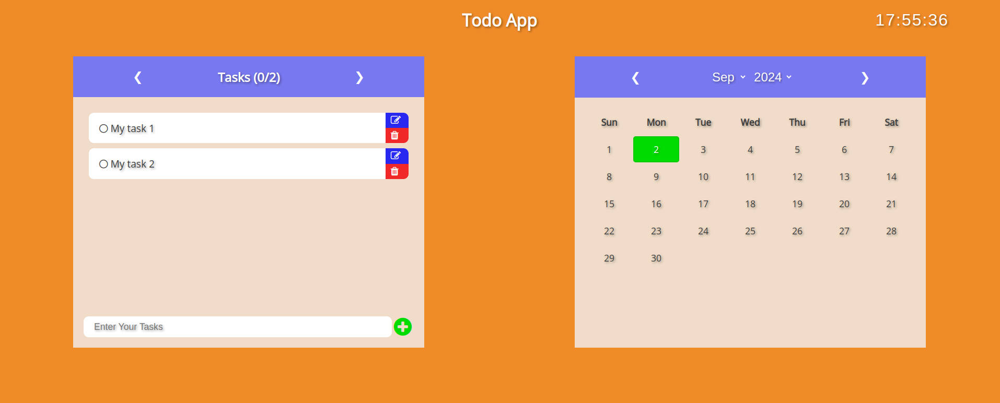

# Todo app with day calendar using HTML, CSS, Javascript.

A simple Todo application integrated with calendar, built with HTML, CSS, and Javascript

## Screenshot



<!-- ## Table of Contents

- [Features](#features)
- [Demo](#demo)
- [Installation](#installation)
- [Usage](#usage)
- [Screenshots](#screenshots)
- [Contributing](#contributing)
- [License](#license) -->

## Features

- Add, edit, and delete tasks
- Mark tasks as completed
- Tasks attached with calendar

## Demo

Check out the live demo [here](https://guna81.github.io/todo-app).

## Clone the repository

```bash
git clone https://github.com/guna81/todo-app.git
cd todo-app
```
